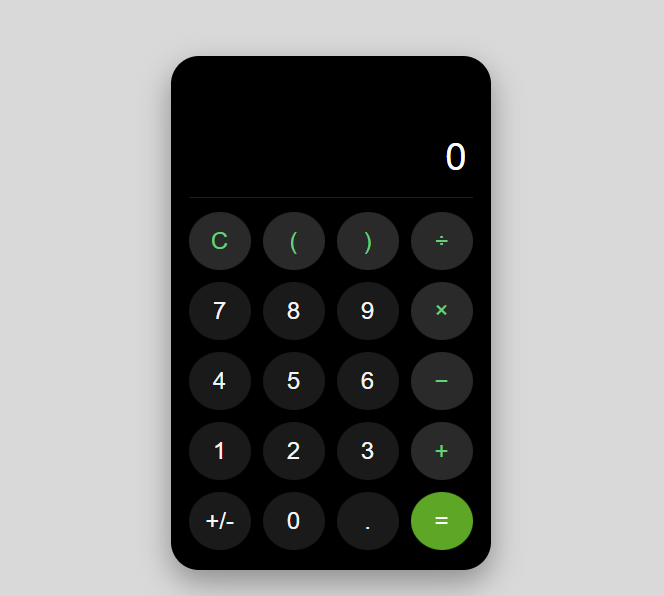
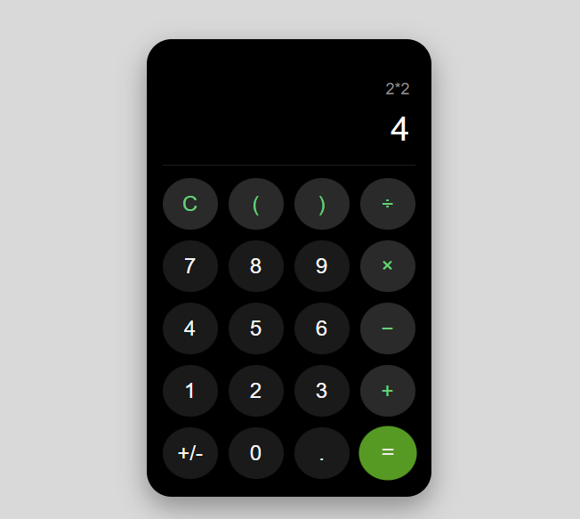

# CalculatorApp

## Project Description
This project is a simple web-based calculator application developed using HTML, CSS, and JavaScript. The calculator performs basic arithmetic operations such as addition, subtraction, multiplication, and division. The goal of this project is to demonstrate the use of front-end web development technologies to build an interactive application.

The calculator features a modern and user-friendly interface inspired by mobile calculator designs. Users can perform calculations easily through the graphical buttons displayed on the screen.

## Technologies Used
The following technologies were used to develop this project:

HTML5 – Used to structure the calculator interface.

CSS3 – Used to style the calculator and create a modern layout.

JavaScript – Used to implement the calculator logic and interactive functionality.

## Features
This calculator application includes the following features:

Basic arithmetic operations

Addition (+)

Subtraction (-)

Multiplication (×)

Division (÷)

Clear button to reset calculations

Support for decimal numbers

Positive and negative number toggle

Styled interface similar to modern mobile calculators

## How to Run the Project
Follow these steps to run the calculator on your computer:

Download or clone the repository.

Open the project folder.

Locate the index.html file.

Double-click the file or open it in any web browser.

The calculator will open in the browser and you can start performing calculations.

## Project Structure
CalculatorApp
│
├── index.html
├── styles.css
├── script.js
└── README.md

index.html – Contains the structure and layout of the calculator.

styles.css – Contains the styling and design of the calculator interface.

script.js – Contains the JavaScript logic used to perform calculations.

README.md – Contains documentation and instructions for the project.

## Screenshots

## Future Improvements
Possible improvements that could be added in the future include:

Keyboard input support

Scientific calculator features

Improved error handling

Responsive design for mobile devices

## Author
Sinothando Masiki